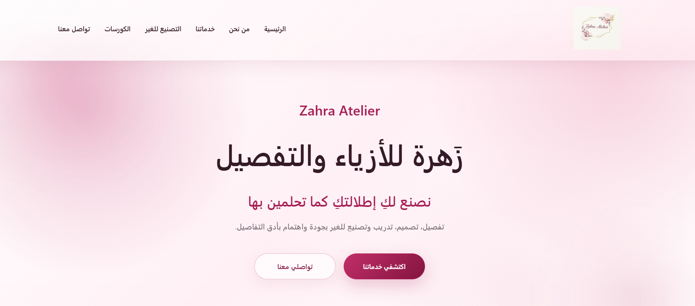

# 🌸 Zahra Atelier

**Zahra Atelier** is a modern, elegant website designed for **Zahra Atelier**, a fashion and tailoring business offering custom clothing, pattern design, sewing training, clothing alterations, and manufacturing for brands.

## 🖥️ Website Preview

## 🌍 Localization & Target Audience

The website was developed primarily in **Arabic**, based on the client's preference and the nature of the business's **target audience**, which is primarily Arabic-speaking customers.

This decision was made to provide a more natural, accessible, and user-friendly experience for the intended users.
## 🎯 The Problem

Zahra Atelier needed a professional online presence to showcase its services and make it easier for customers to discover and contact the business.

However, there were two main challenges:

* The business did not want to pay continuously for a traditional website or expensive hosting solutions.
* The owner did not want to depend on a developer every time a simple update or change was needed on the website.

## 💡 The Solution

I designed and developed a **simple, responsive, and easy-to-manage static website** for Zahra Atelier.

The website can be hosted using **GitHub Pages**, eliminating the need for expensive traditional hosting.

The project was also structured with clear and simple **HTML and CSS**, making basic content and design updates much easier without requiring a developer for every small change.

### ✨ What the Website Provides

* 🏠 Professional homepage
* 👗 Fashion design and tailoring services
* 📐 Pattern design services
* 🎓 Sewing courses and training
* 🪡 Clothing alteration and repair services
* 🏷️ Manufacturing for other brands
* 🕐 Working hours
* 📞 Contact information
* 📱 Instagram and Facebook links
* 🖼️ Portfolio / collection section
* 📱 Responsive design for different screen sizes

## 🛠️ Technologies Used

* **HTML5**
* **CSS3**
* **Responsive Web Design**
* **Git & GitHub**
* **GitHub Pages**

## 📂 Project Structure

zahra-atelier/
│
├── index.html
├── style.css
├── images/
│   └── logo.png.jpg
└── README.md

## 🚀 Deployment

The website is designed to be deployed easily using **GitHub Pages**, allowing Zahra Atelier to have an online presence without relying on a paid website hosting service.

## 🌐 Live Website

**Zahra Atelier:**
https://aytenakl.github.io/zahra-atelier/

## 👩‍💻 Developed By

**Ayten Ehab Akl**
Computer Science & AI Student
Co-Founder & Software Developer — **Due Two**

🔗 **GitHub:** https://github.com/aytenakl

🔗 **Due Two:** https://aytenakl.github.io/Due_Two/

---

© 2026 Zahra Atelier — All Rights Reserved.
